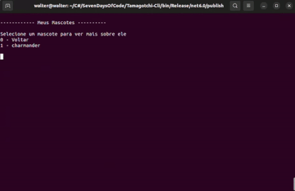
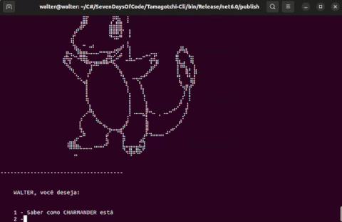

# Tamagotchi-Cli

Uma versão diferente dos antigos Tamagotchis onde você pode escolher um pokemon para ser seu companheiro.

| :placard: Vitrine.Dev |                                         |
| --------------------- | --------------------------------------- |
| :sparkles: Nome       | **7 days of code - Tamagotchi Cli**     |
| :label: Tecnologias   | c#, .Net 6                              |
| :fire: Desafio        | https://7daysofcode.io/matricula/csharp |

#

<!-- Inserir imagem com a #vitrinedev ao final do link -->

## Detalhes do projeto

Projeto proposto pela [Giulia Bordignon](https://www.linkedin.com/in/spacecoding/) para o desafio 7 days of code da Alura.

- Objetivo Geral

Construir em 7 dias uma versão console dos antigos tamagotchis que consuma dados de uma API externa.

- Sobre o projeto

Trata-se de uma aplicação console feita em C# e .Net6, que busca as informações sobre os pokemon na api: [Pokemon API](https://pokeapi.co/docs/v2) e possiblita ao usuário escolher um mascote para poder cuidar, podendo alimentá-lo e também brincar com ele.  

- Extras

Para incrementar o projeto, criei algumas animações utilizando o método [“Thread.Sleep”](https://learn.microsoft.com/pt-br/dotnet/api/system.threading.thread.sleep?view=net-7.0) e inseri imagens em asc. As asc arts foram retiradas dos sites: [Pokemon asc art](https://emojicombos.com/pokemon-ascii-art) , [Gerador de simbolos](https://fsymbols.com/pt/geradores/) e [Ovos em asc art](https://textart.sh/topic/egg)
 

 

 

## Habilidades desenvolvidas

- Durante a construção do projeto, foi possível trabalhar conhecimentos em programação orientada a objetos e em manipulação de dados em C#. A utilização de uma API externa exigiu habilidades em integração de sistemas, compreendendo como a API funciona, como se comunicar com ela e como tratar os dados recebidos.
- A criação de animações utilizando o método Thread.Sleep e a inserção de imagens em ascii art exigiram conhecimentos em manipulação de strings e em técnicas de animação, que posso aplicar em outras áreas do desenvolvimento de software, como em interfaces gráficas de usuário.
- Pela integração de recursos, como as ascii arts de pokemon e ovos, pude trabalhar habilidades de buscar e integrar soluções externas em meus projetos, o que pode ser útil em situações em que é necessário desenvolver um software com recursos limitados ou em um curto prazo.

## Técnologias utilizadas

- [.Net 6](https://dotnet.microsoft.com/en-us/download/dotnet/6.0)
- MVC

## Como rodar o projeto

\*\*\* Necessário .net 6 instalado \*\*\*

- Clone o repositório
- Linux: O execultavel está em /Tamagotchi-Cli/bin/Debug/net6.0/publish/  
  Execultar: `./Tamagotchi-Cli`
- Windows: Rode a aplicação direto pela IDE ou publique o app para gerar o execultavel. 
  Linha de comando: `dotnet publish` e no diretório /Tamagotchi-Cli/bin/Debug/net6.0/publish/ de 2 clicks em `Tamagotchi-Cli.exe`
